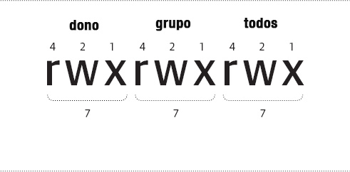

# Terminal Linux (Ubuntu e derivados)

## Navegação

Vistualizar caminho do diretório atual

```console
$ pwd
```

Para navegar entre pastas/diretórios utiliza-se o comando **cd**, cujo significado é um acrônimo da expressão inglesa change directory , ou traduzido "mudar diretório" (diretório é o equivalente a pasta). Ele serve para alterar no terminal o diretório atual de trabalho para uma outra pasta.
Entrando em pastas

```console
$ cd [caminho/nome_diretorio] # Ir para um diretório
$ cd ...    # Voltar para o diretório
$ cd ../../ # Voltar para dois diretório
```

Já para visualizar o conteúdo de um diretório utiliza-se o comnado **ls**

```console
$ ls # Visualiza diretório atual
$ ls [caminho/nome_diretorio] # Visualizar diretório especificado
$ ls -l # Lista seguindo retornando os critérios, respectivamente: permissões, dono, grupo, tamanho, data, hora e nome do arquivo
$ ls -lh # Caso adicione o h é mostrado o tamanho de forma minificada.
```

Criar novo diretório

```console
$ mkdir [nome_diretorio]
```

Limpar terminal

```console
$ clear
```

## Arquivo

Caso queira escrever algo na tela é utilizado o **echo**.

```console
$ echo [texto]
```

Já quando é necessário adicionar/criar um arquivo com o que foi escrito pode utilizar o operador **>**.

```console
$ echo [texto] > [nome_arquivo]
```

Aproveitando que já estamos falando de arquivo, caso queira ler um arquivo sem abri-lo pode utilizar o comando **cat** ou **more**.
Lembrando que o **more** é para visulizar arquivos maiores.

```console
$ cat [caminho/nome_arquivo]
$ more [caminho/nome_arquivo]
```

Copiar arquivos utiliza-se o **cp**. Lembrando que, caso não queira digitar o nome do arquivo no **destino**, basta adicionar **/.** ao final do ultimo diretório, indicando que o arquivo ficará dentro do diretório.

```console
$ cp [caminho_origem] [caminho_destino]
```

Mover ou renomear seque os mesmos princípios da cópia. Contudo, para renomear mas mover o arquivo para o mesmo diretório de origem, mas com o nome diferente.

```console
$ mv [caminho_origem] [caminho_destino]
```

Apagar arquivos/diretórios

```console
$ rm [caminho_arquivo]
$ rm -rf [caminho_arquivo] # r - executa recursivamente, f - forçar. Não é necessário o f para remover
```

## Permissões em arquivo

O comando **chmod** permite alterar as permissões de arquivo, enquanto **chown** altera o dono do arquivo.

Quando utilizamos o comando **ls l**, vemos que as permissções dos arquivos podem estar escritas, por exemplo, desta forma **-rw-r--r--**, **drwxr-xr-x**... Cada grupo de 3 caracteres tem um significado, exceto o primerio que indica se é um diretório, como mostra a imagem:



Nesta imagem cada letra tem um significado, sendo eles:

- **d** - diretório
- **r** - read (leitura)
- **w** - write (escrita)
- **x** - execução

Um exemplo do comando que insere todas as pessoões para todos, seja dono, grupo ou outros, é:

```console
$ chmod 777 arquivo.txt
```

Neste exemplo podemos ver o 777, no qual seus respectivos valores tem como origem 4(r) + 2(w) + 1(x) = 7; Logo, o primeiro 7 representa o dono, o segundo o grupo e o terceiro todos.

Além disso, podemos adicionar o parâmetro -R, fazendo com que a alteração seja recursiva, isto é, afete todas as pastas e arquivos dentro de uma pasta especificada.

```console
$ chmod -R 777 _ # Neste exemplo o _ indica tudo presente no diretório.
```

Outra forma que podemos adicionar permissão é demonstrada no exemplo abaixo, contudo, isto aplicará a permissão tanto para Dono, Grupo e Todos.

```console
$ chmod +x [nome_arquivo|diretório]
```

Agora caso, seja necessário modificar o dono do arquivo basta utilizar o comando **chown**. Lembrando que esta modificação só pode ser aplicada por quem tem permissão, ou o dono do arquivo

```console
$ chown [dono]:[grupo] [arquivo|diretorio]
$ chown root:root arquivo.txt
```

## Adicional

Para executar background, basta adicionar o **&** ao final do comando.

```console
$ [comando_execucao] &
```

Outro comando bem util é o top, que lista todos os processos em execução.

```console
$ top
```

Agora caso queira "matar" ou fechar um processo utiliza-se o **kill**

```console
$ kill -9 [PID]
```

## Root

O usuário **root** é o **administrador-mestre** do sistema operacional. Este usuário tem permissão para visualizar e editar qualquer coisa no SO.

Para usufruie dos poderes do **root**, adicione a palavra **sudo** antes de seus códigos (posteriormente irá pedir sua senha), por exemplo:

```console
$ sudo apt-get install htop
```

Caso queira não queira digitar **sudo** antes de cada comando, pode executar somente o **su** antes de tudo. Este comando faz com que todas as açoes do terminal, naquela sessão, seja aplicado como usuário **root**.

```console
sudo su
```

## Instalar programa em Ubuntu ou seus derivados

Normalmente este comando somente será possível aplicar como **root**

```console
  apt-get install [nome_programa]
```

## Vi

Vi é um editor de texto, normalmente, nativo do terminol

Comando básico para usufruir so **Vi**

- **vi [nome_arquivo]** - Abre um arquivo
- **esc** - Desativo o comando aplicado, por exemplo, ao aplicar o comando **i**, caso queira voltar e aplciar outro comando sempre aperte **esc** antes.
- **i** - Habilita a edição do arquivo, lembrando que o vi tem uma característica de ser sequencial, isto é, caso tente utilizar as setas direcionais para navegar enquanto estiver habilitada a edição as teclas direcionais não funcionaram.
- **dd** - Apaga a linha na qual o cursor se encontra
- **:wq** ou **:x** - Salvar e fechar o arquivo
- **:w** - Salvar o arquivo, sem fechar
- **:q!** - Fecha o arquivo, forçando-o sem salvar as alterações
- **:[numero]** - Pula para a linha especificada
- **/[pesquina]** - Pesquisar por palavras ou expressões no arquivo

## Shell Script

Shell Script tem como extensão **.sh** e para executá-lo é utilizado o comando **bash**.

```console
$ bash [nome_arquivo_script]
```

Caso criar criar um comentário funcional dentro do script, como por exemplo **#!/bin/bash**, é necessário adicionar o prefixo **#!**.

O comentário funcional **#!/bin/bash** tem como propósito ocultar o comando **bash** para executar o arquivo. Logo, para executar um arquivo com este comentário basta digitar:

```console
$ ./[nome_arquivo_script]
```

Lembrando que para ser executado com o prefixo **./**, o terminal deve estar apontando para o diretório onde está o arquivo, caso contrário é necessário digitar o caminho.

## Desligar | Reiniciar

Reiniciando o computador

```console
sudo shutdown -r now
```

Desligando o computador

```console
sudo shutdown -h now
```

## Adicional

Fechar/Sair do terminal

```console
exit
```
